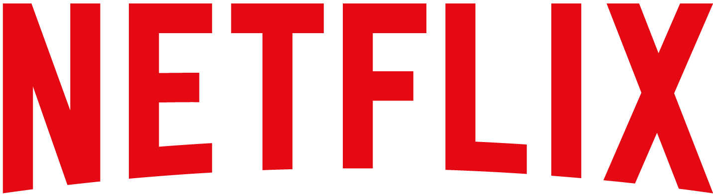
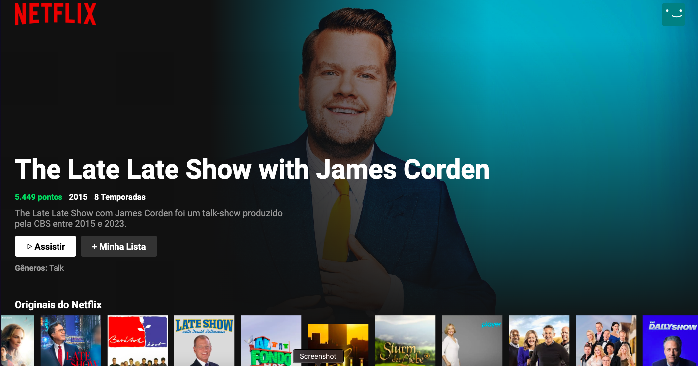

<h3 align="center">
        
    
 Clone Netflix UI 

</h3> 

## Indice

[Projeto](#projeto) | [Features](#features) | [Demonstração](#demonstração) | [Tecnologias](#tecnologias) | [Licença](#licença)

 
### `Projeto`

**Clone Netflix** - Projeto ministrado pelo professor Boenick Lacerda, API fornecida pelo The Movie Database. 

### `Features`

 ✅ Filme Destaque  
 ✅ Filmes Originais Netflix  
 ✅ Filmes divididos em categorias: romance, ação, etc  
 ✅ Setas de rolagem da lista  
 ✅ Preview do título selecionado  
 ✅ Recomendações de filmes/séries 

### `Demonstração`

<h1>
    
</h1>

### `Tecnologias`

- ReactJS
- Javascript
- Next.js

### `Direitos`

Todos direitos são reservados a Netflix e ao The Movie Database.

### `Licença`

Esse projeto está sob a [LICENSE](https://www.themoviedb.org/api-terms-of-use) MIT.

